# Les 12 archétypes de Nen

À la création, ou lorsqu'il apprend le Nen en cours de jeu, le personnage choisit un archétype parmi douze. L'archétype fixe ses aptitudes de départ dans les six catégories de Hatsu, c'est-à-dire où son aura est la plus à l'aise.

## L'affinité

Chaque personnage a une affinité, en pourcentage, pour chacune des six catégories de Hatsu. Elles se disposent en hexagone (renforcement, émission, manipulation, spécialisation, conjuration, transmutation, puis retour au renforcement) : plus deux catégories y sont proches, plus leurs affinités se ressemblent. Sa catégorie vaut 100 %, les voisines 80 %, le cran suivant 60 %, l'opposée 40 %.

Cette affinité se lit sur deux plans :

| Affinité | Ce qu'elle gouverne |
|---|---|
| Apprentissage | la vitesse à laquelle on apprend et progresse dans une catégorie |
| Application | la puissance du Nen quand on emploie cette catégorie |

Le pourcentage fixe les deux à la fois : une affinité élevée s'acquiert vite et frappe fort, une affinité faible reste lente à développer et faible en puissance.

## Simple ou hybride ?

Six archétypes sont simples : ils concentrent le potentiel sur une seule catégorie, portée au maximum. Six autres sont hybrides : ils le répartissent sur deux catégories voisines, un peu en deçà du sommet.

Le choix oppose la puissance à l'ampleur : le simple frappe le plus fort là où il excelle, l'hybride renonce à ce sommet pour deux registres voisins presque égaux, plus souples face à des situations variées.

Les deux hybrides qui touchent à la spécialisation (Manipulateur-Spécialiste et Conjurateur-Spécialiste) restent exceptionnels : la spécialisation ne s'ouvre presque jamais par le seul entraînement, et on les réserve aux personnages au potentiel singulier.

## Choisir son archétype

Un personnage choisit librement son archétype, sauf la spécialisation et ses deux hybrides (Manipulateur-Spécialiste et Conjurateur-Spécialiste), réservés aux porteurs de l'avantage [Spécialiste](avantages.md) : à peine 0,033 % des utilisateurs de Nen y accèdent.

À défaut de choisir, il s'en remet au hasard avec un d100. La spécialisation et ses deux hybrides n'y figurent pas.

| 1d100 | Archétype |
|---|---|
| 01–22 | Renforceur |
| 23–41 | Émitteur |
| 42–56 | Transmuteur |
| 57–68 | Manipulateur |
| 69–80 | Conjurateur |
| 81–87 | Renforceur-Émitteur |
| 88–93 | Renforceur-Transmuteur |
| 94–97 | Émitteur-Manipulateur |
| 98–100 | Transmuteur-Conjurateur |

> \* Valeur atteinte uniquement avec l'avantage [Spécialiste](avantages.md) ; sans lui, la spécialisation reste à 0 %.

---

## Archétypes simples

Un archétype simple porte sa catégorie à 100 %, et les autres décroissent selon l'hexagone : 80 % pour les deux voisines, 60 % au cran suivant, 40 % pour l'opposée.

---

### Renforceur

Le Renforceur est le combattant de Nen le plus direct : il amplifie de son aura les capacités d'un corps ou d'un objet (force, vitesse, dureté, endurance, guérison). C'est la catégorie la plus équilibrée, aussi solide en défense qu'en attaque, taillée pour le corps à corps. Ses pouvoirs sont peu spectaculaires, mais nul ne l'égale en puissance brute au contact.

| Catégorie | Base d'Affinité |
|---|---|
| Renforcement | 100 % |
| Émission | 80 % |
| Transmutation | 80 % |
| Manipulation | 60 % |
| Conjuration | 60 % |
| Spécialisation | 0 % ou 40 %* |

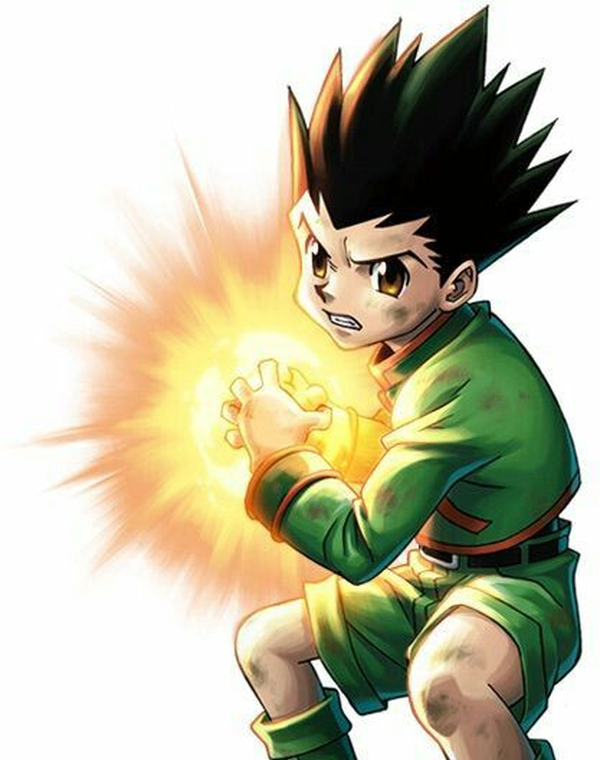<a class="credit" href="https://i.pinimg.com/474x/41/5b/23/415b2334fdb58e90bf98b59a7e0ddb7e.jpg" title="Source : Pinterest" target="_blank" rel="noopener">Pinterest</a>

*Gon Freecss*

---

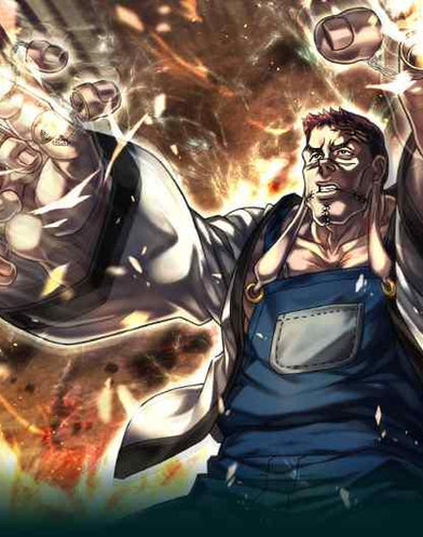<a class="credit" href="https://manga-imperial.fr/cdn/shop/articles/dbdoss5-89416ee7-5986-4c7e-9e23-ceab7e52fba0_be2502bf-abe6-44e2-83cf-ddc6a009533d_600x.jpg?v=1671887178" title="Source : manga-imperial.fr" target="_blank" rel="noopener">manga-imperial.fr</a>

*Franklin*

### Émitteur

L'Émitteur déploie son aura loin de son corps. Là où l'aura ordinaire se disperse dès qu'elle s'éloigne, la sienne reste stable et intacte à grande distance. Il frappe là où nul n'atteint, mais son aura déportée l'expose au corps à corps, qu'il préfère éviter.

| Catégorie | Base d'Affinité |
|---|---|
| Renforcement | 80 % |
| Émission | 100 % |
| Transmutation | 60 % |
| Manipulation | 80 % |
| Conjuration | 40 % |
| Spécialisation | 0 % ou 60 %* |

---

### Transmuteur

Le Transmuteur change les propriétés de son aura pour lui faire imiter une substance : tranchante, élastique, collante, électrique ou brûlante. Elle en prend les propriétés, jamais la matière réelle : une aura électrique garde les qualités d'aura et n'agit pas tout à fait comme une vraie décharge. Au contact, chaque coup porte l'effet qu'il a façonné.

| Catégorie | Base d'Affinité |
|---|---|
| Renforcement | 80 % |
| Émission | 60 % |
| Transmutation | 100 % |
| Manipulation | 40 % |
| Conjuration | 80 % |
| Spécialisation | 0 % ou 60 %* |

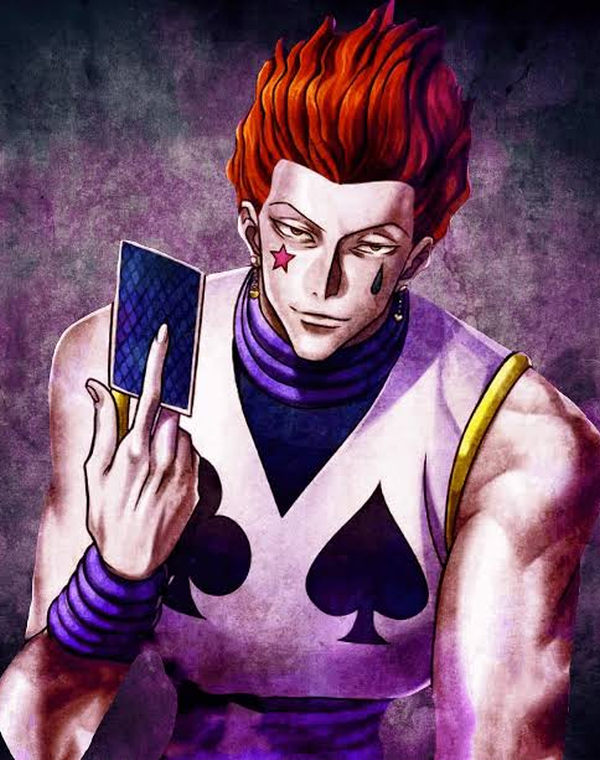<a class="credit" href="https://encrypted-tbn0.gstatic.com/images?q=tbn:ANd9GcRwjPa0xXgMCxhIkpsUh9iSfp9PryTnFf284kPyeKER8IdS1mvnEB23EF9O&amp;s=10" title="Source : Google images" target="_blank" rel="noopener">Google images</a>

*Hisoka*

---

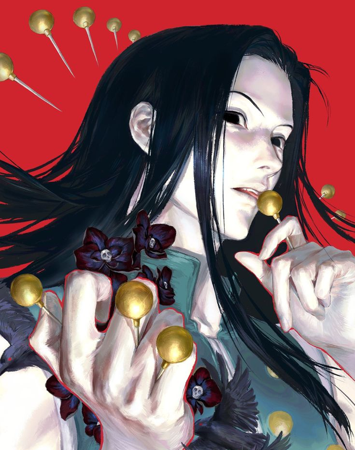<a class="credit" href="https://i.pinimg.com/736x/d0/39/b1/d039b1123c46e8847cc8b3c3909382f4.jpg" title="Source : Pinterest" target="_blank" rel="noopener">Pinterest</a>

*Illumi Zoldyck*

### Manipulateur

Le Manipulateur tourne son aura vers le contrôle des êtres et des objets. Son pouvoir s'assortit presque toujours de conditions fixées d'avance (marionnettes, ordres imposés, emprise scellée par un contact ou un rituel) : plus elles sont contraignantes, plus son emprise est forte. Il combat rarement de front : il prépare le terrain et retourne ses cibles pour qu'elles se battent à sa place.

| Catégorie | Base d'Affinité |
|---|---|
| Renforcement | 60 % |
| Émission | 80 % |
| Transmutation | 40 % |
| Manipulation | 100 % |
| Conjuration | 60 % |
| Spécialisation | 0 % ou 80 %* |

---

### Conjurateur

Le Conjurateur donne à son aura une existence matérielle : des objets bien réels et indépendants, que l'on touche et qu'un tiers perçoit. Une fois l'objet maîtrisé, il l'invoque et le congédie à volonté, et lui attache des propriétés qu'aucune autre catégorie ne produirait. C'est là que le Nen est le plus inventif : un objet conjuré fait presque n'importe quoi, pour peu que son créateur en ait fixé les règles.

| Catégorie | Base d'Affinité |
|---|---|
| Renforcement | 60 % |
| Émission | 40 % |
| Transmutation | 80 % |
| Manipulation | 60 % |
| Conjuration | 100 % |
| Spécialisation | 0 % ou 80 %* |

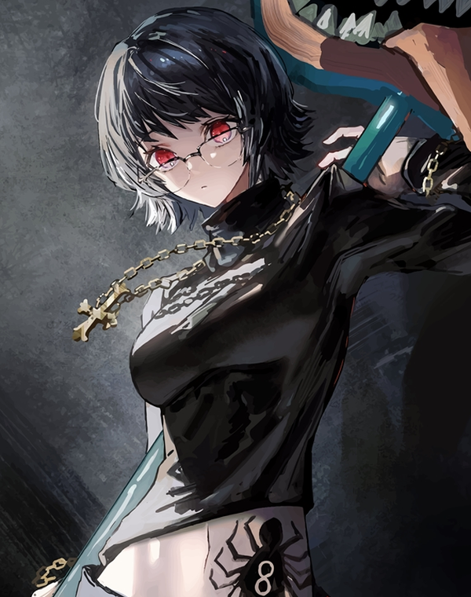<a class="credit" href="https://media.printler.com/media/photo/196734.jpg" title="Source : printler.com" target="_blank" rel="noopener">printler.com</a>

*Shizuku Murasaki*

---

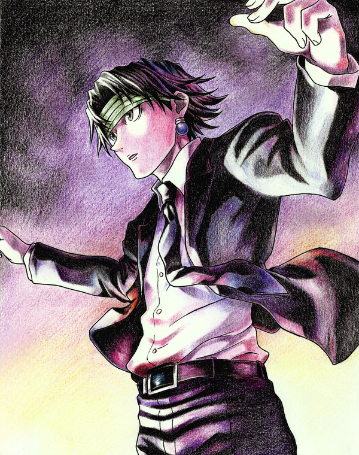<a class="credit" href="https://i.redd.it/gh8kwp08xrk81.jpg" title="© jessejzette_art" target="_blank" rel="noopener">© jessejzette_art</a>

*Chrollo Lucilfer*

### Spécialiste

Le Spécialiste échappe à toute classification : sa catégorie réunit les pouvoirs qui n'entrent dans aucune des cinq autres. Ses effets sont uniques, propres à chacun, sans règle commune. On naît Spécialiste plus qu'on ne le devient : c'est de loin l'archétype le plus rare et le plus imprévisible.

Cet archétype, comme ses deux hybrides, ne peut être choisi sans l'avantage [Spécialiste](avantages.md) : sans lui, l'affinité de spécialisation reste à 0 %.

| Catégorie | Base d'Affinité |
|---|---|
| Renforcement | 40 % |
| Émission | 60 % |
| Transmutation | 60 % |
| Manipulation | 80 % |
| Conjuration | 80 % |
| Spécialisation | 0 % ou 100 %* |

---

## Archétypes hybrides

Un archétype hybride répartit son potentiel entre deux catégories voisines, à 90 % chacune. Aucune n'atteint le sommet d'un archétype simple, mais deux familles de Hatsu s'ouvrent presque également : 90 % pour les deux pôles, 70 % pour leurs voisines, 50 % pour les deux dernières.

---

### Renforceur-Émitteur

Le Renforceur-Émitteur tient du combattant comme du tireur. Il décuple son corps comme un Renforceur, puis détache cette puissance pour frapper au loin comme un Émitteur. De près comme de loin, ses coups gardent la force du renforcement : un archétype très polyvalent.

| Catégorie | Base d'Affinité |
|---|---|
| Renforcement | 90 % |
| Émission | 90 % |
| Transmutation | 70 % |
| Manipulation | 70 % |
| Conjuration | 50 % |
| Spécialisation | 0 % ou 50 %* |

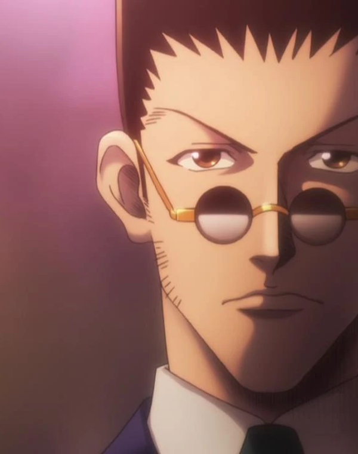<a class="credit" href="https://hunterxhunter.fandom.com/wiki/Leorio_Paradinight" title="Madhouse (anime) · HxH Wiki" target="_blank" rel="noopener">Madhouse · HxH Wiki</a>

*Leorio*

---

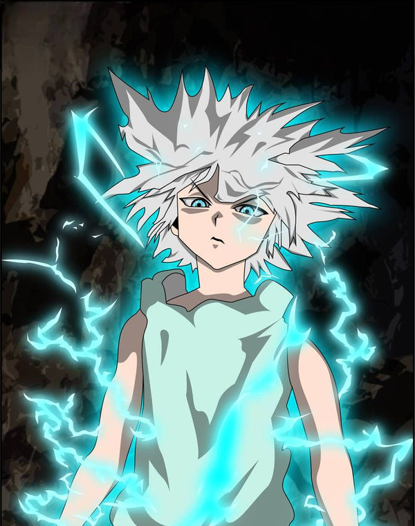<a class="credit" href="https://i.pinimg.com/736x/5f/a5/56/5fa556d13270e9ced36f1a99f6d96c45.jpg" title="Source : Pinterest" target="_blank" rel="noopener">Pinterest</a>

*Killua Zoldyck*

### Renforceur-Transmuteur

Le Renforceur-Transmuteur amplifie son corps comme un Renforceur, puis prête à son aura les propriétés qu'il imagine comme un Transmuteur. Il combat au contact, de coups chargés de tranchant, d'électricité ou de tout autre effet façonné dans son aura.

| Catégorie | Base d'Affinité |
|---|---|
| Renforcement | 90 % |
| Émission | 70 % |
| Transmutation | 90 % |
| Manipulation | 50 % |
| Conjuration | 70 % |
| Spécialisation | 0 % ou 50 %* |

---

### Émitteur-Manipulateur

L'Émitteur-Manipulateur projette son aura au loin sans en perdre la main. Il marie la portée de l'émission à l'emprise de la manipulation : ses tirs suivent les conditions qu'il leur a fixées, frappent à distance et reviennent là où on ne les attend pas.

| Catégorie | Base d'Affinité |
|---|---|
| Renforcement | 70 % |
| Émission | 90 % |
| Transmutation | 50 % |
| Manipulation | 90 % |
| Conjuration | 50 % |
| Spécialisation | 0 % ou 70 %* |

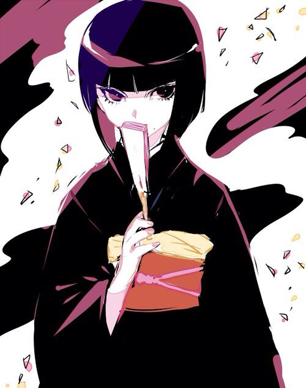<a class="credit" href="https://i.pinimg.com/564x/ed/a5/f9/eda5f9f6130460e9c91a750c0989ff2a.jpg" title="Source : Pinterest" target="_blank" rel="noopener">Pinterest</a>

*Kalluto Zoldyck*

---

<a class="credit" href="https://twitter.com/hun_bbokbbok/status/1551967248235266048" title="© hun_bbokbbok" target="_blank" rel="noopener">© hun_bbokbbok</a>

*Kite*

### Transmuteur-Conjurateur

Le Transmuteur-Conjurateur prête à son aura les propriétés qu'il imagine comme un Transmuteur, puis lui donne une existence matérielle comme un Conjurateur. Il fait surgir des objets bien réels, taillés sur mesure, porteurs des qualités de son choix : tranchant, élasticité, charge électrique.

| Catégorie | Base d'Affinité |
|---|---|
| Renforcement | 70 % |
| Émission | 50 % |
| Transmutation | 90 % |
| Manipulation | 50 % |
| Conjuration | 90 % |
| Spécialisation | 0 % ou 70 %* |

---

### Manipulateur-Spécialiste

Le Manipulateur-Spécialiste joint le contrôle de la manipulation aux effets singuliers de la spécialisation. Il soumet êtres et objets à sa volonté, et son emprise s'affranchit des règles communes par un trait qui n'appartient qu'à lui. C'est l'un des deux hybrides réservés aux Spécialistes.

| Catégorie | Base d'Affinité |
|---|---|
| Renforcement | 50 % |
| Émission | 70 % |
| Transmutation | 50 % |
| Manipulation | 90 % |
| Conjuration | 70 % |
| Spécialisation | 0 % ou 90 %* |

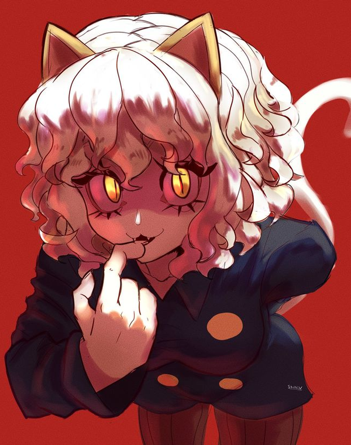<a class="credit" href="https://i.pinimg.com/736x/17/0b/e8/170be8e716c3082d2bff44903ed43eeb.jpg" title="© shiniv (Pinterest)" target="_blank" rel="noopener">© shiniv</a>

*Neferpitou*

---

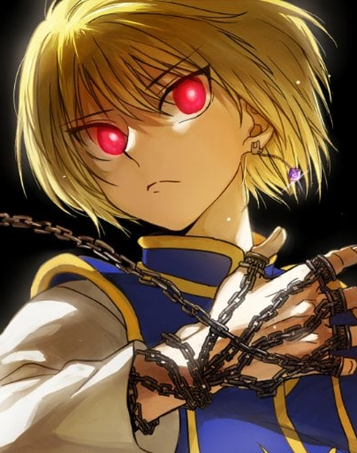<a class="credit" href="https://preview.redd.it/how-to-build-kurapika-kurta-in-6-levels-v0-s6zxfjmjejz51.jpg?width=512&amp;format=pjpg&amp;auto=webp&amp;s=3b6993431efe1642cb9b94bcb1cfc8aaf4949c77" title="Source : Reddit" target="_blank" rel="noopener">Reddit</a>

*Kurapika*

### Conjurateur-Spécialiste

Le Conjurateur-Spécialiste crée des objets bien réels comme un Conjurateur, mais les dote de propriétés ou de fonctions qu'aucune autre catégorie ne saurait produire, à la manière d'un Spécialiste. C'est le second hybride réservé aux Spécialistes.

| Catégorie | Base d'Affinité |
|---|---|
| Renforcement | 50 % |
| Émission | 50 % |
| Transmutation | 70 % |
| Manipulation | 70 % |
| Conjuration | 90 % |
| Spécialisation | 0 % ou 90 %* |

