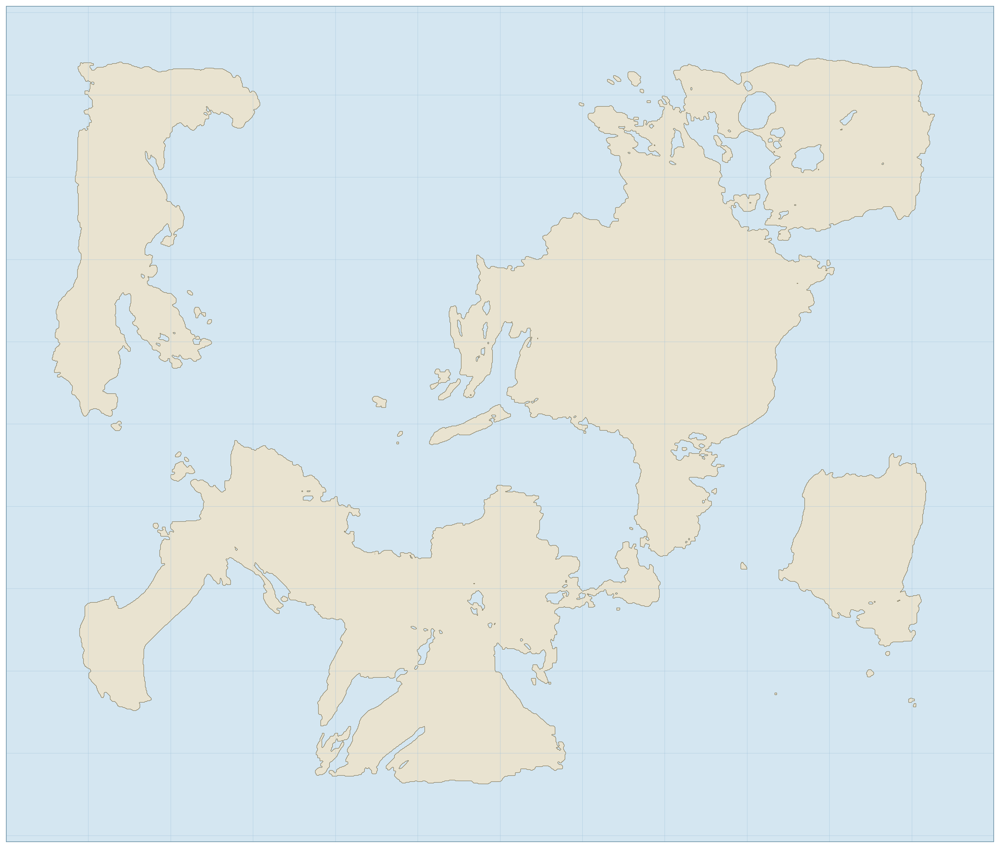
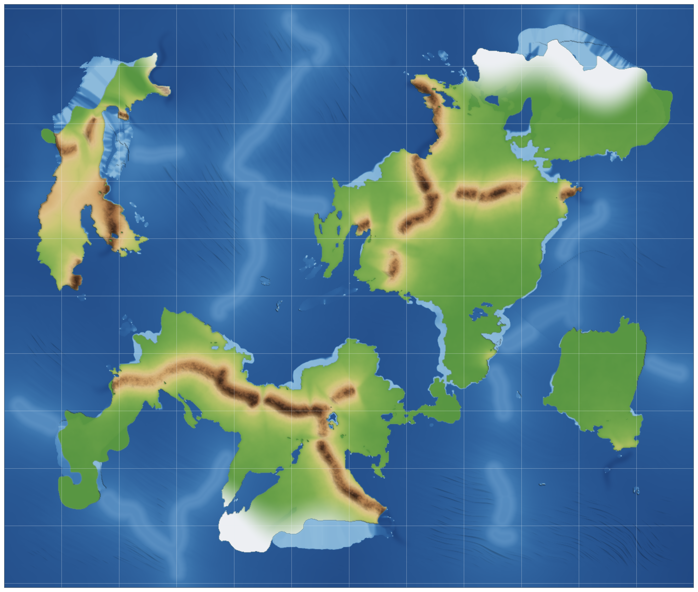
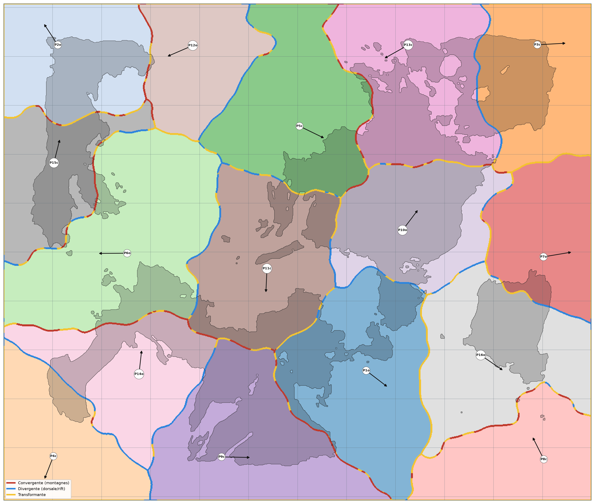

# Cartes du monde

Le monde connu forme une étendue plate, cernée d'océan sur tous ses bords. Ce que montrent ces cartes n'est que la part explorée : au delà de la limite tracée, les terres restent à découvrir.

Trois lectures de la même géographie sont proposées ci dessous.

## Carte physique

Les terres émergées et les mers, sans frontières.

## Relief

Les altitudes et les profondeurs. Les plaines vertes couvrent l'essentiel des terres ; les chaînes de montagnes se dressent là où les plaques se compriment, au cœur comme en bordure des continents, parfois jusque sur les côtes. Sous la mer, le relief n'est pas uniforme : les fonds s'approfondissent à mesure que l'on s'éloigne des côtes, des hauts-fonds pâles du littoral jusqu'aux abysses sombres du large.

## Plaques tectoniques

Les plaques et leurs mouvements. Les frontières en rouge soulèvent les montagnes là où deux plaques se compriment, celles en bleu marquent les zones où elles s'écartent, celles en jaune celles où elles coulissent. Chaque plaque est océanique ou continentale ; les continents naissent des plaques continentales, et leurs côtes, adoucies, ne suivent pas exactement le tracé des frontières.

> Monde généré de façon procédurale, graine 314159265 (une dizaine de plaques). Les plaques portent le relief : là où elles se compriment, elles dressent des chaînes de montagnes ; ailleurs s'étendent de larges plaines. La carte est cernée d'océan sur tous ses bords. Le monde est plat et la grille est uniforme. Changer de graine régénère toute la géographie.
